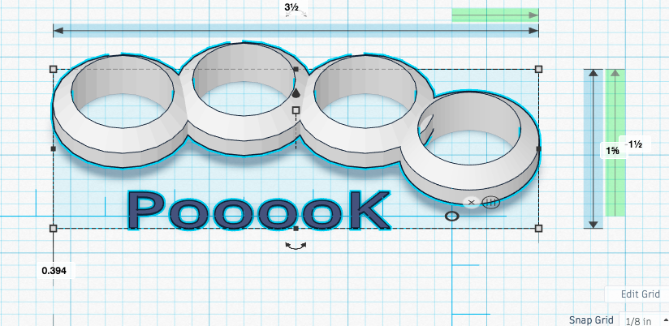

# Pooook Prose Knuckles {#brass-knuckles-for-the-information-age}

<<<<<<< HEAD
```{r prototype-design,echo=FALSE,fig.cap='Prototype Design',fig.align='center',out.width='100%'}

```
=======
#### Abstract {-}

(ref:abs1)

#### Keywords {-}
>>>>>>> d0372646eb57d9f3409fedd0d8adf79b0c083b1c

#### Keywords {wearables, touch type, keyboarding, knuckles}

## Still Chained to our Keyboards?

Picture a desk worker, stepping out for lunch - only to have his or her phone blow up with texts, messages, and emails 🔥📱🔥. Should this mid-day "break" be spent mentally composing - and hoping to later recall - intended replies until back at a keyboard? Or face-down, inefficiently stabbing at a tiny alphabet on a tiny screen?

These choices are especially painful for those of us who can touch-type with speed and accuracy. We're the ones who type only a *little* slower than we think. We're the ones who find voice recognition software especially galling: all that imprecision with key people/place/product names, punctuation and formatting requires time-consuming rework. Not to mention that dictating sensitive content requires constant access to a quiet, private place - lest we be overheard.

What we want is a way to untether our typing skills...without having to ditch years of muscle memory. There is a "coming soon" product called Tap that purports to offer keyboard-free gesture recognition for "typing, gaming, music and more," but this device requires users spend hours getting trained with uncomfortable new fingerings ("d" is typed by pressing down with the middle and pinky fingers, while lifting the ring finger, for instance). If we wanted to learn guitar- or piano-like chord fingerings, we'd pick up a musical instrument!

Instead, it's time we design a wearable solution that leverages our time-tested typing skills - already standardized via [QWERTY](https://en.wikipedia.org/wiki/QWERTY) and [Dvorak](https://en.wikipedia.org/wiki/Dvorak_Simplified_Keyboard) keyboards.  With the [miniature accelerometers](https://thepihut.com/products/triple-axis-accelerometer-bma220-tiny) that can translate motion into device input now at hobbyist pricepoints, we can loose the chains tying good typists to our keyboards. There's really no good reason why we can't compose our prose on any surface - literally - at hand.   

And it's not just desk workers who could benefit from *board-cutting* in addition to cord-cutting. Picture:

* the farmer 👩🏼‍🌾 inspecting a field,
* the scientist 👨🏾‍🔬 elbows-deep in an experiment,
* the investigative journalist 🕵🏼 chasing a quickly-developing 📰 story
* the surgeon 👩‍⚕️ already prepped for surgery,
* the activist blogger 🧕🏽 attending a protest
* the cop 👮🏽 out walking the beat, etc.

In all of the above cases, silently capturing observations (or executing just-in-time precision searches) could be invaluable. There's really no need for our species' continued reliance on the keyboard. Someday soon, keyboards are going to look about as antiquated as the punch card.

## Data Science to Kick the Keyboard Habit

The Pooook Prose Knuckles product concept is to embed the necessary sensor circuits into a pair of wearable input devices having the form factor of brass knuckles, but bendy like those Livestrong bracelets. The consumer owning a pair of Pooooks would pair them with a phone or tablet, and then simply parrot a few on-screen prompts to train their personalized wearables to interpret their individual typing style.

The design would build on the Ring GINA wearable computer interaction devices [@greenspun_ring_2014] developed in UC Berkeley's Department of Electrical Engineering and Computer Science. Our data science team would design Pooook flexible knuckle-sets to be 3D printed with the end goal being to insert the necessary accelerometers, Bluetooth connectors, and wristwatch-style "self-winding" batteries.

Once we assemble the prototype devices, the data science team would recruit touch-typing testers with measurably fast and accurate keyboarding skills for the machine learning portion of the project. For each tier in the increasingly-complex standard keyboard inputs listed below, the data science team would design software to classify Pooook-sensed accelerated finger movements in x-y-z space, outputting granular values corresponding to typed input:

 * Tier 1 letters: "a" vs "q" and "z", "f" vs "r" and "v", etc.
 * Tier 2 essential punctuation: spacebar, return, delete, apostrophe, comma, period...
 * Tier 3 punctuation requiring shifting (e.g. "?", quotes, colon etc.)
 * Tier 4 capital letters (again requiring shifting)
 * Tier 5 numbers (both inline and via number-keypads like those used by cashiers)
 * Tier 6 special characters (@, $, %, +, -, \*, /, etc.)

The "ground truth" for machine learning in each tier would always begin with keyboards under the hands of the Pooook-wearing typists, who would input expected (screen-prompted, then later improvised) characters, words, and phrases. Once accuracy is proven with keyboards in place, the keyboard hardware would be removed and replaced with solid flat surfaces (like a desk),  angled flats (like an airplane's fold-down tray), and ultimately curved & softer spots like chair arms and the typists' laps.

This keyboard-first approach would be recommended to the ultimate consumers as well (whether at home or in stores/schools/libraries), so that the software can be personalized to the way each individual typist engages. To achieve snappy time-to-value for new owners of the product, the data science goal should be that Pooook customers have no need to change their typing behavior. Customers should train the Pooooks, and not the other way around.

## The Post-Keyboard Era

Once freed from bulky keyboards, humans can more easily get out into the world - reporting better the truth of what we find there, and what we think about these findings. We'll procrastinate and forget less, as we won't have to put off until later that which we can do RIGHT. NOW.

All of us could benefit, too, from additional contributors. Perhaps a billion of our fellow travelers on this planet use their 📱 as their only means of connection to the information age. Without full-size keyboards to make prose composition easy and efficient, some may feel relegated to the role of information accessors, not as much information creators. It's time the internet era benefited from the voices and ideas of all of us 📈.

While Pooook would first be developed for the English QWERTY and Dvorak keyboards, that *certainly* doesn't mean Pooook software models would stop there. In fact, the Pooook data science team should aim to design an API-first platform, so that developers everywhere could extend their Pooook software to provide precise input as needed in more circumstances:

 * international languages,
 * math, science, and industry-specifics,
 * accessibility tools, and more.

Isn't it time for wearable precision input devices? Join the Pooook team today!
