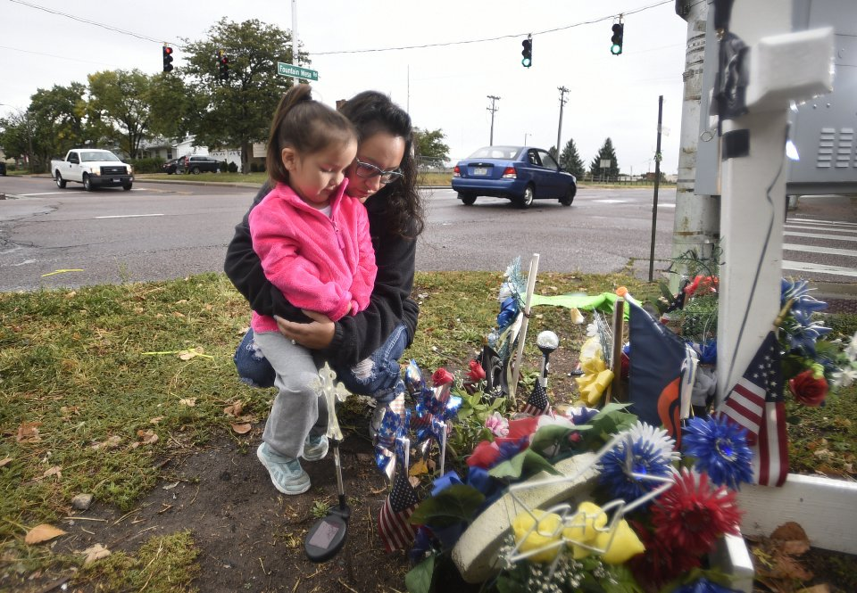

# See Around Corners for Traffic Safety {#smart-intersections-could-save-lives}

#### Keywords
traffic fatalities, self-driving cars, autonomous vehicles, smart intersections, machine learning, predictive analytics

## Smart, Self-Sensing Intersections Could Save Lives

According to the [Association for Safe International Road Travel](http://asirt.org/initiatives/informing-road-users/road-safety-facts/road-crash-statistics), thousands of lives are lost worldwide *each day* when cars collide with each other and with other roadway users, such as motorcyclists, pedestrians, cyclists, etc. Such collisions also lead to tens of millions of injuries each year, causing untold pain and productivity loss. Many count on the advent of self-driving cars to fix the problem for good, yet it could very well be decades before even a single country's fleet is fully automated. Let's not wait on that solution.

```{r descanso,echo=FALSE,fig.cap='Colorado family visits roadside memorial. [@riley_family_2017]',fig.align='center',out.width='100%'}

```

About 40% of crashes take place at intersections [@choi_crash_2010], and it has been determined that over 50% of those intersection crashes are due to either "inadequate intersection surveillance" or "turning into an intersection with an obstructed view". Traffic signals and stop signs can only *prompt* users to follow the rules of the road, they can't force compliance. All roadway users cheat the rules when in a rush, knowing that lights (and certainly signs) don't have realtime information like their own senses (supposedly) do. But humans are lousy at surveillance; there are blind spots in what we can see (behind utility poles, trees, tall vehicles, curves, etc.) and there are also blind spots in what we recognize (if you're not looking for a bike, you may not see one). The tragedy lies in thinking you've adequately scanned your surroundings, when in fact you haven't. Such a lack of information on-hand (right in the very moment a critical decision is being made) seems like something that we in the so-called *information age* should be able to address.

This project aims to partner with one of the cities that has already committed to the [Vision Zero Network](https://visionzeronetwork.org/resources/vision-zero-cities/), with the aim of investigating whether an inexpensive new Data Science approach could help prevent traffic fatalities and serious injuries at known-dangerous intersections. Researchers have analyzed years of data regarding such intersections where - time and time again - people and property are harmed, reports are written, debris is cleared away, and then traffic flow continues...until the next crash [@chen_analysis_2012]. Everything gets scrutinized, down to crosswalk wait times and headphone use [@brosseau_impact_2013]. It's encouraging that *informing* pedestrians with a countdown showing how long they'll have to wait (given present signal timings) can reduce illegal jaywalking[@lipovac_influence_2013]. But few seem to be making plans to bridge the main information gap directly (given current users traveling via their specific methods, exactly what resource contention may be predicted for the N strips of asphalt, concrete, gravel, or dirt in this intersection).

What if, instead of waiting for a slowly-growing number of smart cars to learn to handle every possible intersection and/or roadway condition, we instead invested in instrumenting known-bad intersections, turning them into informed, connected objects, with knowledge of their own historical pitfalls? We can invest in the infrastructure we already have a lot more easily than we can goad drivers into purchasing fancy new smart cars. We can teach smart intersections to track their users, learn their trajectory patterns by user type, and inform those present whenever a collision is probable. And when we fail, smart intersections can instantly notify emergency responders, and warn off incoming users.

Some municipalities are already installing cameras at intersections in order to use computer vision to detect, classify and warn of potential conflicts [@zangenehpour_automated_2015]. This work with video is challenging, however, "due to the constant change of orientation and appearance of pedestrians and cyclists". It's very likely that certain maneuvers (like an illegal U-turn) may be best detected with cameras, but cameras also require clear sight-lines and must transmit and store a vast amount of data. The following approach could certainly work alongside cameras in intersections that warrant the highest level of instrumentation, but for the vast majority of intersections that won't get video surveillance any time soon, the following proposal recommends another path, relying on road user characteristics that don't change as often as visuals, and also preventing the transmission and storage of personally-identifiable information.

## The Data Science of Smart Intersections

The key to this project's approach lies in the classification and characterization of roadway users according to mass (which, unlike physical appearance/orientation, does *not* change during traversal of a given intersection) and velocity (which can be expected to change only within predictable user-type bounds). The combination of mass and velocity is momentum - literally defined as mass in motion. Momentum is an especially appropriate factor for classification and prediction in a traffic risk-avoidance scenario because momentum is conserved in a collision: the wider the gap between two objects' momentums, the more potential harm to the lower-momentum party. Given like speeds, a wheelchair user hitting someone on a bike will do much less harm than an 18-wheeler hitting someone on a bike.

For this pilot project, snapshots of momentum would be determined for each roadway user approaching an intersection via means of a *series* of inexpensive, weather-proof vibration-sensor packs, semi-permanently adhered to intersection surfaces (like curbing). Each individual sensor-pack would be a combination of [piezoelectric elements](https://www.adafruit.com/product/1739) - converting various levels of vibration into various levels of voltage - and an array of [vibration sensor switches](https://www.adafruit.com/?q=vibration%20sensor%20switch) - which either do or do not close a circuit, depending on the level of vibration impinging upon them. While pilot placement is envisioned along the vertical edges of curbing walls, it is not inconceivable that (in the absence of curbing) such components could be installed in ordinary roadway reflectors in a later phase, expanding coverage to more of the population. Additionally, some intersections already have car-counting strips, and a series of these on approach routes could augment sensor-packs that must be installed further from roadways in order not to miss users without vehicles.

An intersection's set of sensor-packs should be distributed every few meters along its approach paths (for instance, along each of 3 lanes in a "T"-shaped intersection). BLE (Bluetooth low energy) wireless connections would communicate precise sensor-pack locations and vibration readings - all in real-time - to the smart intersection's own edge gateway device. It is important to note that we must avoid network latency in this situation where milliseconds can matter. The gateway device must be capable of performing the real-time analysis and alerting onsite, forwarding only compressed, aggregate data to the internet for tasks that can lag, like monitoring and maintenance.

Once a pilot intersection's gateway is set up to receive data from its sensor-packs, the Data Science team will supervise training of its software, so that this individual intersection can classify its intersection users according to user types, identifying, for instance:

* a deer 🦌 vs.
* a child on a scooter 🛴 vs.
* a wheelchair user ♿ vs.
* a bike commuter 🚴♀️ vs.
* a giant delivery truck 🚚, etc.

One key point is that training of the machine learning models must be an investment in each intersection (and its sensor pack installations) individually. There's no other adequate way to establish ground truth to the level of precision our predictions would require. A given piece of concrete may produce certain vibrations when traversed by a wheelchair, and an altogether different pattern may emerge from a standard skateboard. Similarly, a speed bump comprised of a given material could get walloped by a racing fire engine one moment (producing large vibrations) and then barely move the needle moments later when crossed by a thin-wheeled roadbike. All of this could likely be measured during normal traffic flow, or else detoured-&-artificially-controlled traffic flow. Community input and intersection-specific historical incident data can be used as well. For instance, a gravel bike path leading to a busy crossing to an elementary school may need specialty sensors or additional training. Prior to "going live" with any given smart intersection, transportation safety staff would be involved to conduct a gauge repeatability and reproducibility study, logging the intersection's new instrumented capabilities and/or any areas that may need improvement.

Why does classification of user type and momentum matter so much? Two reasons:
1. We expect that segmenting user types will improve the predictability of user trajectories, because standard deviations by type are likely to have a much tighter sigma (vs lumping all roadway users into one probability distribution). You will rarely see a baby carriage dart in front of a speeding truck, but deer often exhibit this very behavior. Trains rarely make sudden U-turns, but cars just might (especially when seeing their way blocked by a long train).
2. We should also aim on the side of caution when predicting collision risk if/when more vulnerable roadway users are present. Sideswiping a truck isn't as dangerous as sideswiping a trike. Our tolerances can and should be tighter. Many states have laws about stopping all traffic flow adjacent to offloading school buses. Can you think of an intersection that frequently sees big disparities in user momentum? One that often has real-time signals and even access controls? Think about where you're 40x more likely to die than if you were hit by a car - a railroad crossing [@dot_railroad_nodate]. The train's momentum is so high that it's hard to wrap a human brain around (e.g. it can take over a mile for a train to reach a complete stop).

Once live, an intersection's status (for instance, 2 cyclists approaching uphill, a delivery van barreling downhill, and a wheelchair user waiting behind a utility pole to enter the crosswalk) could be broadcast locally to a "See Around Corners" mobile app. Those wishing to make informed intersection traversals could simply download the app and activate voice warnings, hearing "Incoming downhill!" in any preferred language. Notice especially that anyone - not just drivers - could avail themselves of this foresight. Perhaps, with the backing of Vision Zero and a large metro area, car manufacturers could be persuaded to incorporate smart intersection data into their auto-braking technology. Regulations could force older commercial vehicles without such tech to install positive control mechanisms, or at least require verbal warnings for drivers. And cities seeking faster progress on their Vision Zero goals could install sight/sound devices at every corner of a problematic intersection, enabling "in-your-face" warnings from our intersection "guardian angels"...at least until we develop instant force-fields.

The fundamental research question then becomes: can machine learning be used to train a smart intersection to detect and classify roadway users, predicting  potential paths with enough precision to warn users *before* a collision? If so, what level of false positives and false negatives should be expected and accepted? What degradation in a given intersection's sensor or prediction service levels should trigger remediation? This would be a topic of debate, surely, but with the backing of experts at the Vision Zero Network, we imagine that stakeholders like city governments, emergency responders, auto insurers, and parents could push for adoption of minimum levels of protection. While it took time, this same coalition was successful in fighting the status quo and establishing cutoffs regarding blood alcohol levels allowed while driving - some of which are even enforced down to an individual driver's starter-interrupter device.

## Self-Driving Cars to Co-Exist with Smart Intersections

Autonomous cars are on the roads now [@hersman_reducing_2017], and this project takes no issue with their progress. When cars can keep other cars (and buses, and trains, etc.) informed about which resources are needed by whom and when, movements can be coordinated and accident rates should fall.

But mixed-mode transit is also here to stay, and therefore we can't expect vehicles alone to carry all the burden of preventing roadway injury and death. There will always be other modes in play. Globally, some prefer not to own a vehicle, and some don't have the means. Many embrace active modes of transportation, like walking and cycling. This shouldn't relegate large swathes of the population to simply being a special category for accommodation in car company's self-driving algorithms *if at all possible*. Instead, we can be designing traffic safety solutions designed to work *now*, folding in autonomous vehicles as they gain traction. Every node - including smart, self-sensing intersections - in our transit grid can contribute. It's time we smarten up our intersections so they can serve and protect everyone.

 🚌 - ♿ - 🏍️ - 🛹 - 🚒 - 🚶🏿 - 🛵 - 🛹 - 🏎️ - ⛹️♀️ - 🛴 - 🏃🏼 - 🧳 - 🚙 - 🚴🏽♀️ - 🚓 - 🚇
